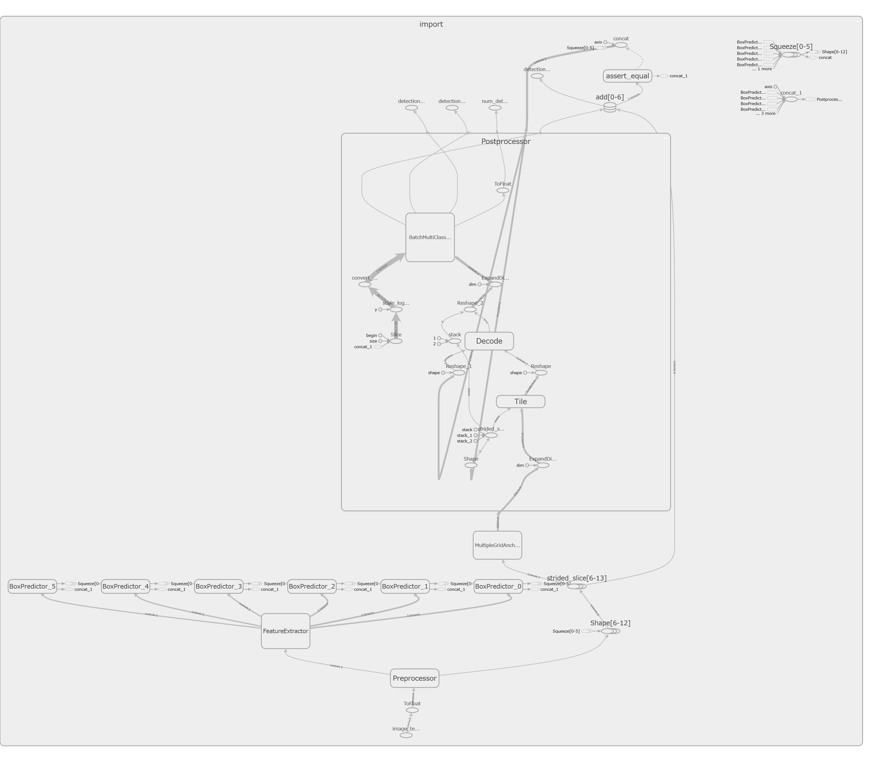
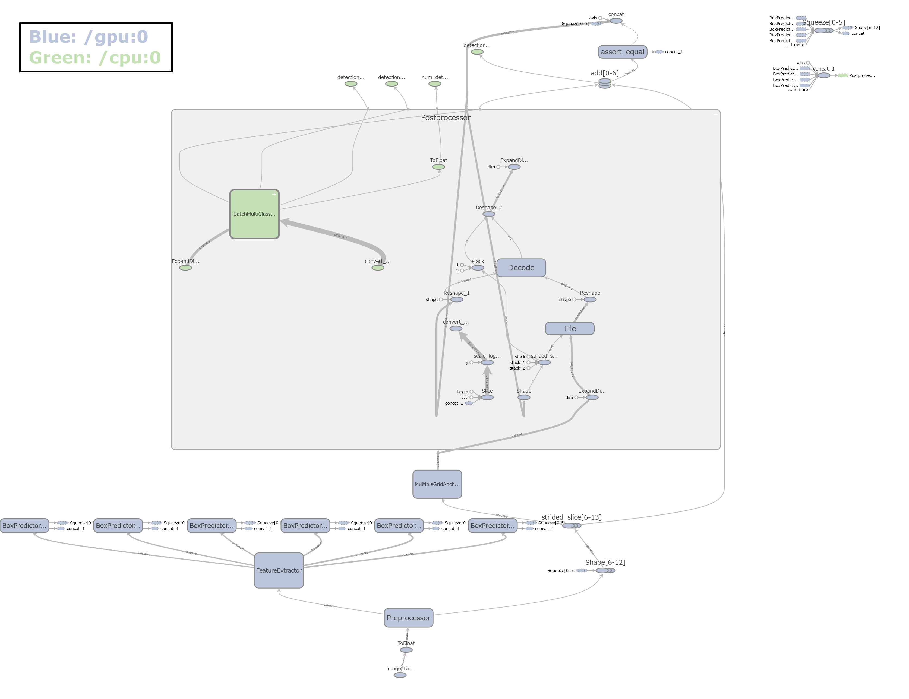
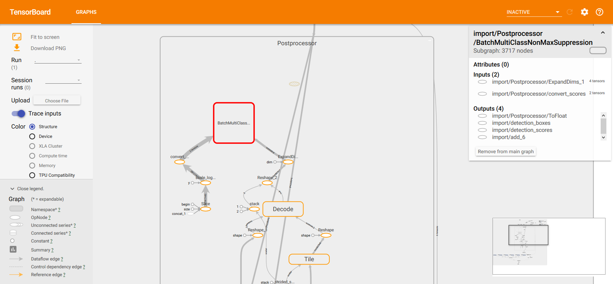
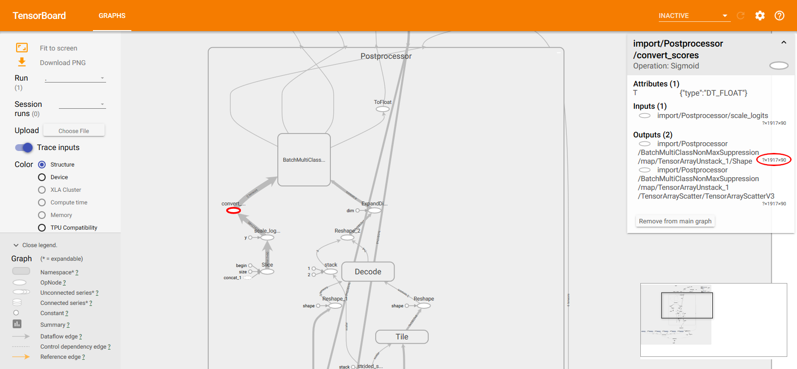
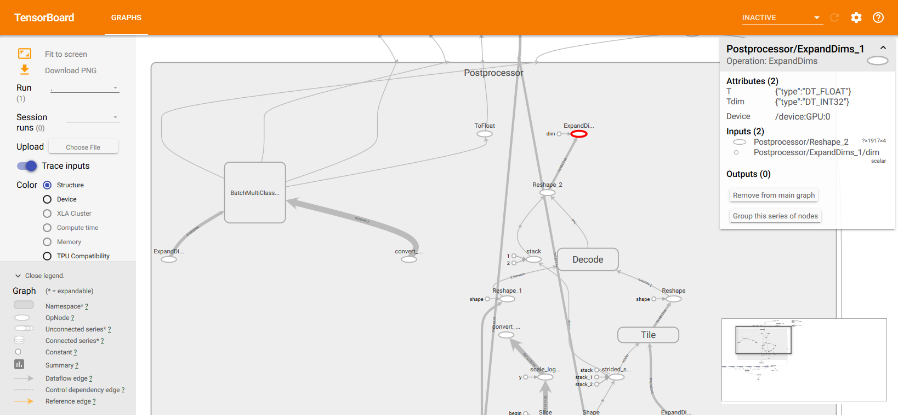
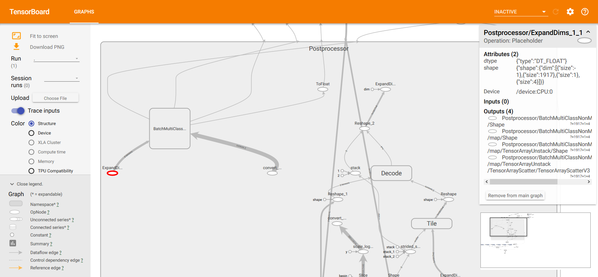

# Learn Split Model

## Processing Flow of Single Shot MultiBox Detector: SSD
SSD consists of three parts.<br>
1. Prepare. (Resize image to 300x300.)
2. Detection. (Find a candidate boxes.)
3. Non-Maximum Suppression. (Final detection.)
<br>
Split model divides the model before and after non-maximum suppression.<br>
This split position provides an excellent performance and solves the performance problem of tf.where on GPU.<br>


## The first split model was created by @wkelongws.
He did nice work!<br>
For realtime object detection, this is the most important part.<br>
[https://github.com/tensorflow/models/issues/3270](https://github.com/tensorflow/models/issues/3270)<br>
before split ssd_mobilenet_v1_coco_2017_11_17:<br>
<br>
after split ssd_mobilenet_v1_coco_2017_11_17:<br>
<br>


## Learn how to divide ssd_mobilenet_v1_coco_2017_11_17 model.
### First point: Non-Maximum Suppression.
This has two input nodes.<br>
<br>

<hr>

### Second point: Two input nodes: ExpandDims_1 and convert_scores.
#### Postprocessor/ExpandDims_1
Shape of ExpandDims_1 is ?x1917x1x4. (see output shape)<br>
"?" means that input array length is not fixed length.<br>

This input array length using as mini batch size "24" at the training time.<br>
At the prediction time, input image uses with array as [[image]]. This means the input array length is "1".<br>
(When the prediction time, you can predict multiple images at once.)<br>

In the training time and prediction time, input image array length is different. Therefore, the input is defined with tf.placeholder and the shape is defined as "None"(means not fixed array length).<br>

That "None" will appear as "?".<br>

<br>
Divide here.<br>
Write the definition of this division point in the source code:[lib/load_graph_nms_v1.py](lib/load_graph_nms_v1.py) as follows.<br>
```python
        SPLIT_TARGET_EXPAND_NAME = "Postprocessor/ExpandDims_1"
```

#### Postprocessor/convert_scores
Shape of convert_scores is ?x1917x90. (see output shape)<br>

<br>
Divide here.<br>
Write the definition of this division point in the source code:[lib/load_graph_nms_v1.py](lib/load_graph_nms_v1.py) as follows.<br>
```python
        SPLIT_TARGET_SCORE_NAME = "Postprocessor/convert_scores"
```

<hr>

### Add new inputs (score_in, expand_in) for secondary graph (cpu part).
Write new inputs in default graph with tf.placeholder. source code:[lib/load_graph_nms_v1.py](lib/load_graph_nms_v1.py)<br>
```python
        tf.reset_default_graph()
        if ssd_shape == 600:
            shape = 7326
        else:
            shape = 1917
        """ ADD CPU INPUT """
        score_in = tf.placeholder(tf.float32, shape=(None, shape, num_classes), name=SPLIT_TARGET_SCORE_NAME)
        expand_in = tf.placeholder(tf.float32, shape=(None, shape, 1, 4), name=SPLIT_TARGET_EXPAND_NAME)
```
The first, I reset the default graph. I wrote it to mean that the graph is empty at this time.<br>
The shape is in the previous graph diagram.<br>
Set the same name for name. The new input name is appended "_1" to the name automatically, so use it.<br>

### Use split model.
The input of the primary graph (gpu part) does not change and it is image array. The output operation names are ExpandDims_1 and convert_scores.<br>

The input of secondary graph (cpu part) becomes expand_in and score_in created with tf.placeholder. The output operation names are not change, these are detection_boxes, detection_scores, detection_classes and num_detections.<br>

If load_graph() returns expand_in and score_in, I can use it for secondary graph's input tensor. But I wrote it with graph.get_tensor_by_name() like any other operations.<br>
source code:[lib/detection_nms_v1.py](lib/detection_nms_v1.py)<br>
```python
        if SPLIT_MODEL:
            score_out = graph.get_tensor_by_name('Postprocessor/convert_scores:0')
            expand_out = graph.get_tensor_by_name('Postprocessor/ExpandDims_1:0')
            score_in = graph.get_tensor_by_name('Postprocessor/convert_scores_1:0')
            expand_in = graph.get_tensor_by_name('Postprocessor/ExpandDims_1_1:0')
```

<hr>

### Diagram of split model.
New Output: ExpandDims_1 and convert_scores.<br>
<br>
<br>

New Input: ExpandDims_1_1 and convert_scores_1.<br>
<br>
<br>

<hr>

